# MisTree

MisTree is a React application that allows users to visualize and interact with tree diagrams for a target github repository. Built with Vite and styled using Tailwind CSS, MisTree provides an intuitive interface for exploring hierarchical data structures. Lightweight and responsive, MisTree is designed to make things like visualizing a repository's directory structure and settings easier.

## Features

- **Github Repository Visualization**: Visualize the directory structure of a target github repository.
- **Interactive Tree Diagrams**: Visualize complex data structures with zoom and pan functionality.
- **Settings Modal**: Customize your experience with a settings modal accessible from the header.
- **API Integration**: Connect to external APIs using the settings modal to fetch and display data.
- **Automation**: Powered by Mistral AI for automation and enhanced functionality.

**Example**

```mermaid
graph TD
    mistree[mistree] --> _gitignore[.gitignore]
    mistree[mistree] --> LICENSE[LICENSE]
    mistree[mistree] --> LICENSE_MIT[LICENSE-MIT]
    mistree[mistree] --> README_md[README.md]
    mistree[mistree] --> eslint_config_js[eslint.config.js]
    mistree[mistree] --> index_html[index.html]
    mistree[mistree] --> package_lock_json[package-lock.json]
    mistree[mistree] --> package_json[package.json]
    mistree[mistree] --> postcss_config_js[postcss.config.js]
    mistree[mistree] --> src[src]
    mistree[mistree] --> tailwind_config_js[tailwind.config.js]
    mistree[mistree] --> tsconfig_app_json[tsconfig.app.json]
    mistree[mistree] --> tsconfig_json[tsconfig.json]
    mistree[mistree] --> tsconfig_node_json[tsconfig.node.json]
    mistree[mistree] --> vite_config_ts[vite.config.ts]
```


## Installation

To get started with MisTree, follow these steps:

1. **Clone the Repository**:
   ```bash
   git clone https://github.com/blue-lotus-org/mistree.git
   cd mistree
   ```

2. **Install Dependencies**:
   ```bash
   npm install
   ```

3. **Run the Development Server**:
   ```bash
   npm run dev
   ```

4. **Open in Browser**:
   Open your browser and navigate to `http://localhost:5173` to see the application in action.

## Usage

- **Navigating the Settings Modal**: Click on the settings icon in the header to open the settings modal. Here you can set your API key and choose a model.

## Configuration

MisTree allows you to configure the following settings:

- **API Key**: Set your API key to connect to external services.
- **Model**: Choose a model to customize the behavior of the application.

## Contributing

We welcome contributions to MisTree! To contribute, follow these steps:

1. Fork the repository.
2. Create a new branch for your feature or bug fix.
3. Make your changes and commit them with descriptive messages.
4. Push your changes to your fork.
5. Open a pull request to the main repository.

Please ensure your code adheres to the project's coding standards and includes appropriate tests.

## License

This project is licensed under the MIT, Apache License. See the LICENSE files for details.

## Credits
- Mistral ai
- [Blue Lotus](https://lotuschain.org) - The organization behind MisTree.
